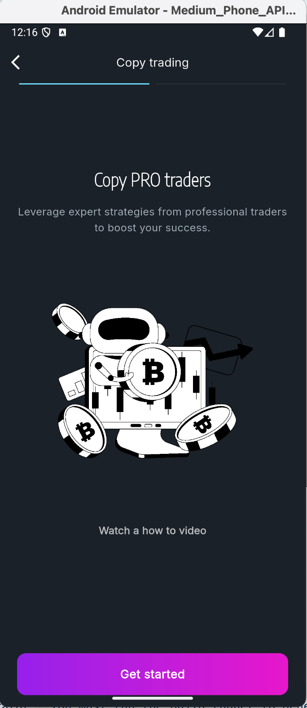
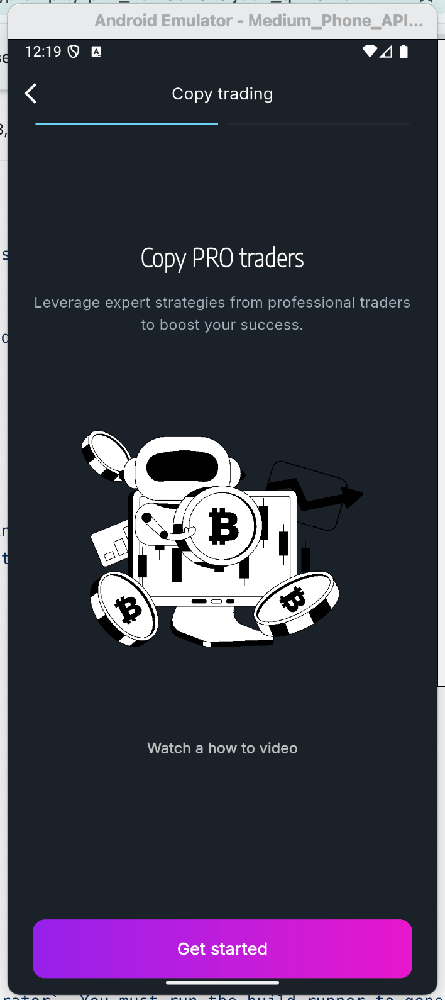
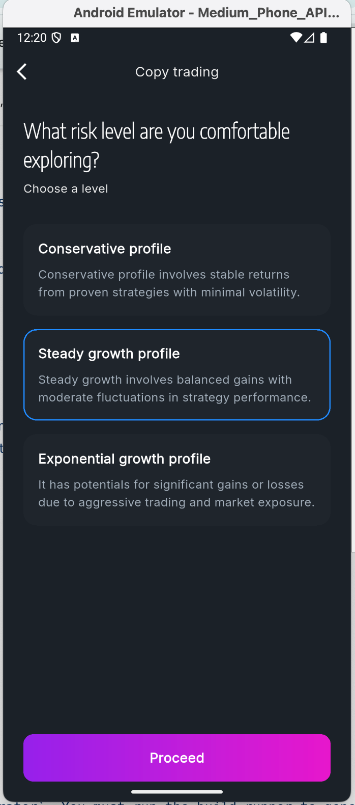
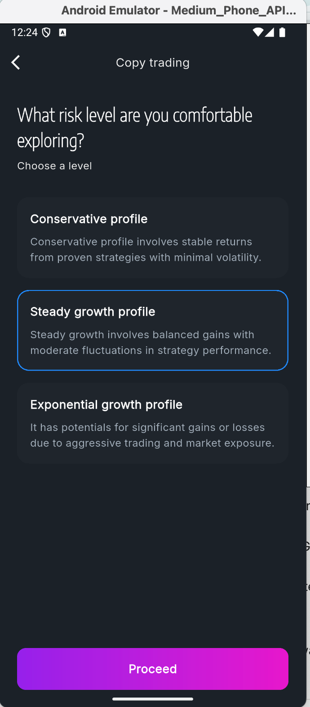
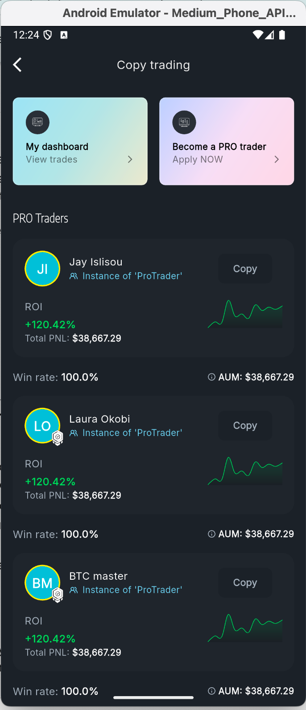
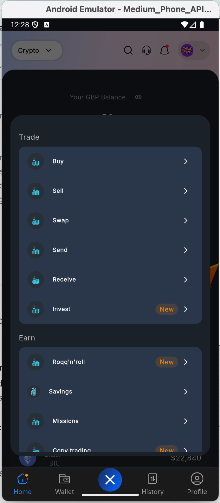
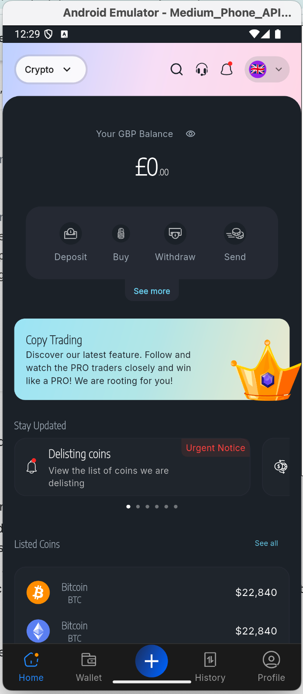

# Roqqu Mobile Developer Assessment

A high-fidelity Flutter implementation of the Roqqu copy trading platform UI, built as a technical assessment suppport. This project demonstrates a production-quality application that is performant, well-architected, and easy to maintain, with a strong focus on clean code, smooth animations, and a professional development workflow.

## 🚀 Project Showcase

*(A GIF recording of the application running in the emulator. This demonstrates the key user flows, animations, and UI components implemented.)*










---

## ✨ Key Technical Decisions & Highlights

This project was built not just to meet the requirements, but to showcase a deep understanding of modern Flutter development best practices.

*   **Declarative, Type-Safe Navigation:** Implemented a centralized routing system using the **`go_router`** package. This decouples pages from one another and provides a clear, URL-based structure for all navigation flows, including complex nested navigation for the main tabbed interface (`StatefulShellRoute`).

*   **Pragmatic State Management:** A hybrid state management approach was chosen for optimal performance and code clarity:
    *   **Riverpod:** Used for managing shared application state and dependency injection (e.g., modal visibility, WebSocket data streams). All providers are code-generated for type safety.
    *   **`StatefulWidget`:** Intentionally used for managing ephemeral, self-contained UI state (e.g., `AnimationController`s, `PageController`s) where a global provider would be overkill. This demonstrates a nuanced understanding of state types.

*   **Advanced Animations:** The UI is brought to life with a combination of implicit and explicit animations:
    *   **Implicit Animations (`AnimatedContainer`):** Used for simple, state-driven UI changes like button selections.
    *   **Explicit Animations (`AnimationController`):** Used for complex, staggered animations (e.g., the modal overlay "pinch out" effect) and continuous animations (e.g., Rive character movements) to create a fluid and polished user experience.

*   **Component-Based & Reusable UI:** The UI is composed of a library of reusable widgets located in `lib/common/widgets`. This promotes consistency, reduces code duplication, and follows the DRY (Don't Repeat Yourself) principle.

*   **Automated Quality Gates (CI/CD):** The repository is configured with a **GitHub Actions** workflow that automatically runs `flutter analyze` and `flutter test` on every pull request. This ensures that no new code violates quality standards or breaks existing functionality.

---

## ✅ Assessment Requirements Checklist

-   [x] **Accuracy to Design:** Meticulous, pixel-perfect implementation of the provided Figma designs.
-   [x] **Animations & Transitions:** Smooth, performant, and meaningful animations are integrated throughout the app.
-   [x] **Architecture & Code Quality:** Built on a scalable **Feature-First, Clean Architecture** model.
-   [x] **State Management:** Effective and appropriate use of **Riverpod** and **`StatefulWidget`**.
-   [ ] **API Integration & Real-Time Data Handling:** *(In Progress)* The architecture is fully prepared for WebSocket integration via a decoupled data layer.
-   [x] **Performance & Optimization:** Smooth scrolling is achieved with `CustomScrollView`/`Slivers` and efficient widget builds.
-   [x] **Testing & Maintainability:** A suite of meaningful **widget tests** and a fully configured **CI pipeline** are present.
-   [x] **Best Practices:** Adherence to Flutter/Dart best practices, a robust navigation strategy, and a clean **feature-branching Git workflow**.

---

## 🏛️ Architecture

The project follows a **Feature-First Architecture** combined with the principles of **Clean Architecture**, separating concerns into three distinct layers within each feature module: **Presentation**, **Domain**, and **Data**. This ensures the codebase is decoupled, scalable, and highly testable. A centralized `AppTheme` class in the `core` layer provides consistent styling across the app.

## 🧪 Testing & CI/CD

The project includes a suite of relevant widget tests in the `test/` directory, focusing on:
1.  **Smoke Testing:** Verifying the app launches and navigates to the initial screen without errors.
2.  **Component Testing:** Testing reusable widgets in isolation to verify their response to different states.
3.  **State Management Testing:** Ensuring UI components correctly react to state changes from Riverpod providers.

All tests are automatically validated by a **GitHub Actions CI pipeline** (`.github/workflows/ci.yaml`).

## 🛠️ Getting Started

### Prerequisites

-   Flutter SDK (version specified in `pubspec.yaml`, e.g., using FVM: `fvm use 3.22.2`)
-   An IDE like VS Code or Android Studio.

### Installation & Setup

1.  **Clone the repository:**
    ```bash
    git clone <your_repo_url>
    cd <your_repo_name>
    ```

2.  **Install dependencies:**
    ```bash
    flutter pub get
    ```

3.  **Run the code generator:**
    This project uses `riverpod_generator`. You must run the build runner to generate the necessary provider files.
    ```bash
    dart run build_runner build --delete-conflicting-outputs
    ```

4.  **Run the application:**
    ```bash
    flutter run
    ```